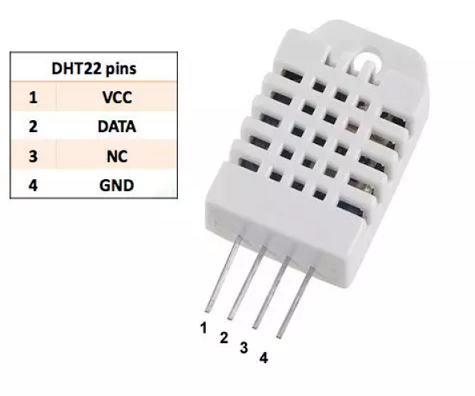
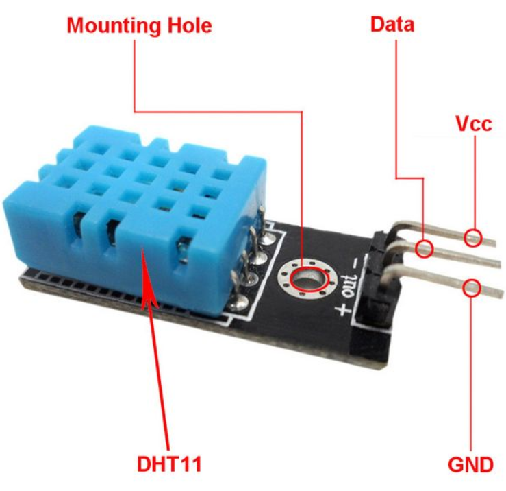
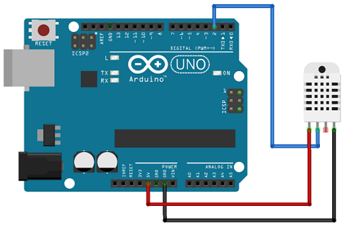
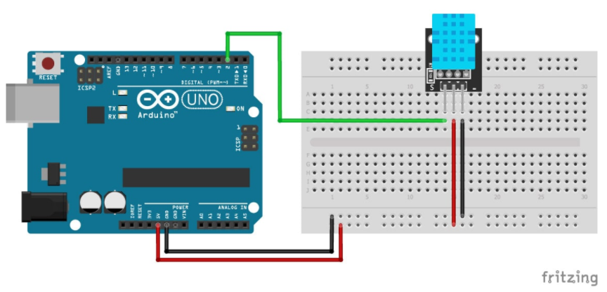

# DHT22 temperatuur- en luchtvochtigheidssensor

De DHT 22 is een temperatuur- en luchtvochtigheidssensor. De data wordt digitaal verzonden over 1 datapin.



Er bestaat een goedkopere, minder nauwkeurige versie namelijk de DHT11, waarbij de data op dezelfde manier wordt verzonden.



## Aansluitschema DHT22

De meeste DHT22 sensoren bezitten 4 aansluitpinnen, waarvan er 1 niet gebruikt wordt.




De meeste DHT11 sensoren bezitten maar 3 aansluitpinnen, namelijk de voeding, de massa en de datapin.



## Voorbeeldprogramma

Het voorbeeldprogramma is geschikt voor zowel de arduino UNO als voor de ESP8266.

Het is nodig vooraf de nodige bibliotheken te downloaden.

```cpp
/* How to use the DHT-11 and DHT-22 sensor with Arduino uno
   Temperature and humidity sensor
*/

//Libraries
#include <DHT.h>;

//Constants
#define DHTPIN 2     // what pin we're connected to
#define DHTTYPE DHT11   // DHT 11
//#define DHTTYPE DHT22   // DHT 22  (AM2302)
DHT dht(DHTPIN, DHTTYPE); //// Initialize DHT sensor for normal 16mhz Arduino


//Variables
int chk;
float hum;  //Stores humidity value
float temp; //Stores temperature value

void setup()
{
  Serial.begin(9600);
  dht.begin();
}

void loop()
{   //Read data and store it to variables hum and temp
    hum = dht.readHumidity();
    temp= dht.readTemperature();
    //Print temp and humidity values to serial monitor
    Serial.print("Humidity: ");
    Serial.print(hum);
    Serial.print(" %, Temp: ");
    Serial.print(temp);
    Serial.println(" Celsius");
    delay(10000); //Delay 10 sec.
}
```
## Probleem met DHT en IOT platform adafruit

De bibliotheek gebruikt in bovenstaande programma komt in conflict met het IOT platform van Adafruit. Een oplossing is het gebruik van een andere bibliotheek, namelijk "DHTesp".

## Voorbeeldprogramma

```cpp
#include "DHTesp.h"

#ifdef ESP32
#pragma message(THIS EXAMPLE IS FOR ESP8266 ONLY!)
#error Select ESP8266 board.
#endif

DHTesp dht;

void setup()
{
  Serial.begin(115200);
  Serial.println();
  String thisBoard= ARDUINO_BOARD;
  Serial.println(thisBoard);

  //dht.setup(D7, DHTesp::DHT22); // Connect DHT22 sensor to D7
  dht.setup(D7, DHTesp::DHT11); // Connect DHT11 sensor to D7
}

void loop()
{
  float humidity = dht.getHumidity();
  float temperature = dht.getTemperature();

  Serial.print(dht.getStatusString());
  Serial.print("Humidity: ");
  Serial.print(humidity);
  Serial.print(" %, Temp: ");
  Serial.print(temperature);
  Serial.println(" Celsius");
  delay(10000); //Delay 10 sec.
}

```
## Leverancier

De DHT22 is o.a. te koop bij opencircuit [opencircuit.nl](https://opencircuit.nl/Product/DHT22-Luchtvochtigheid-en-temperatuur-sensor) 
De DHT11 is o.a. te koop bij opencircuit [opencircuit.nl](https://opencircuit.nl/Product/DHT11-Luchtvochtigheid-temperatuur-sensor) 


## Bron

[create.arduino.cc](https://create.arduino.cc/projecthub/mafzal/temperature-monitoring-with-dht22-arduino-15b013) 
