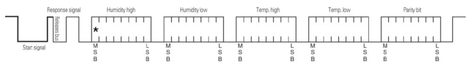

# digitale communicatie

Vele sensoren maken gebruik van digitale communicatie waarbij de data over 1 of meerdere draden doorgestuurd wordt. Een voorbeeld is de DHT22 temperatuur- en luchtvochtigheidssensor. Bij de DHT22 wordt de data doorgezonden over 1 draad zoals je kan zien in onderstaande voorbeeld.

Voor deze sensoren is het meestal nodig een bibliotheek te downloaden.

