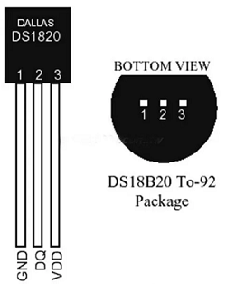
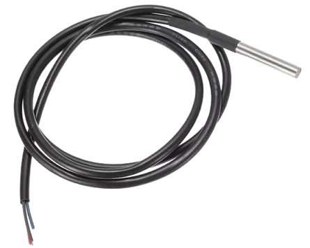
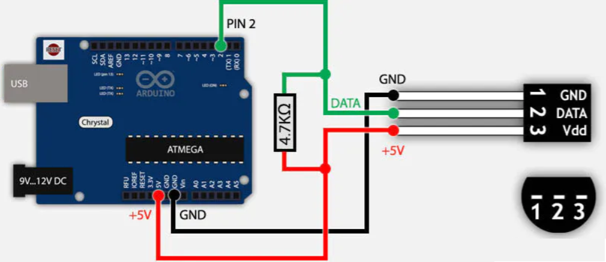

# DS18B20 temperatuursensor

De DS18B20 temperatuursensor maakt gebruik van one-wire buscommunicatie. Er kunnen verschillende DS18B20 temperatuursensoren aangesloten worden op dezelfde bus.

DE DS18B20 is beschikbaar in TO-92 behuizing en als waterdichte sensor.




## Aansluitschema



Vergeet zeker de pull-up weerstand van 4,7K niet te plaatsen tussen de datapin en de voedingsspanning.

## Voorbeeldprogramma

Het voorbeeldprogramma is geschikt voor zowel de arduino UNO als voor de ESP8266.

Het is nodig vooraf de bibliotheken te downloaden.

```cpp
/********************************************************************/
// First we include the libraries
#include <OneWire.h> 
#include <DallasTemperature.h>
/********************************************************************/
// Data wire is plugged into pin 2 on the Arduino 
#define ONE_WIRE_BUS 2 
/********************************************************************/
// Setup a oneWire instance to communicate with any OneWire devices  
// (not just Maxim/Dallas temperature ICs) 
OneWire oneWire(ONE_WIRE_BUS); 
/********************************************************************/
// Pass our oneWire reference to Dallas Temperature. 
DallasTemperature sensors(&oneWire);
/********************************************************************/ 
void setup(void) 
{ 
 // start serial port 
 Serial.begin(9600); 
 Serial.println("Dallas Temperature IC Control Library Demo"); 
 // Start up the library 
 sensors.begin(); 
} 
void loop(void) 
{ 
 // call sensors.requestTemperatures() to issue a global temperature 
 // request to all devices on the bus 
/********************************************************************/
 Serial.print(" Requesting temperatures..."); 
 sensors.requestTemperatures(); // Send the command to get temperature readings 
 Serial.println("DONE"); 
/********************************************************************/
 Serial.print("Temperature is: "); 
 Serial.print(sensors.getTempCByIndex(0)); // Why "byIndex"?  
   // You can have more than one DS18B20 on the same bus.  
   // 0 refers to the first IC on the wire 
   delay(1000); 
} 
```
## Leverancier

De DS18B20 is o.a. te koop bij opencircuit [opencircuit.nl](https://opencircuit.nl/Product/DS18B20-Temperatuur-sensor-probe-1-meter) 

## Bron

[create.arduino.cc](https://create.arduino.cc/projecthub/TheGadgetBoy/ds18b20-digital-temperature-sensor-and-arduino-9cc806) 
