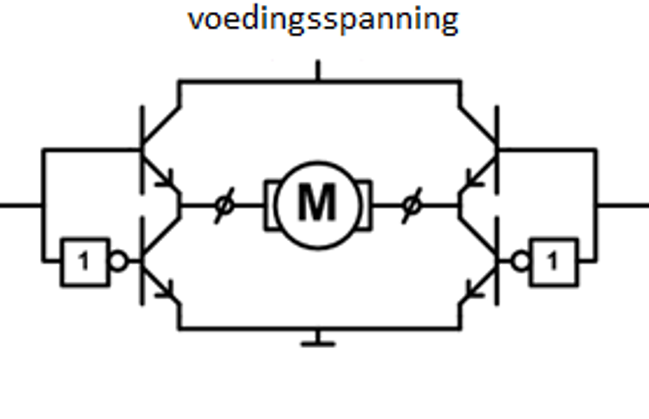

# H-brug

De gevraagde stroom van een DC-motor is meestal hoger dan 20 mA, waardoor deze niet rechtstreeks kan aangesloten worden op de arduino. Met een H-brug is het eveneens mogelijk de draairichting van de DC-motor te veranderen.

Als schakelelementen in een H-brug wordt gebruik gemaakt van halfgeleiders. De schakelsnelheid van een halfgeleider is veel hoger dan van een relais waardoor een PWM-regeling mogelijk is.



## Schema

In onderstaande schema worden 2 DC-motoren via een L298N H-brug geschakeld.


## Voorbeeldprogramma

```cpp

const int IN1 = 9;
const int IN2 = 8;
const int IN3 = 6;
const int IN4 = 7;
const int ENA = 10;
const int ENB = 5;

void setup() {

  pinMode (IN1, OUTPUT);
  pinMode (IN2, OUTPUT);
  pinMode (IN3, OUTPUT);
  pinMode (IN4, OUTPUT);
  pinMode (ENA, OUTPUT);
  pinMode (ENB, OUTPUT);

}

void loop() {
//control speed 
  analogWrite(ENA, 255);
  analogWrite(ENB, 255); 
//control direction 
  digitalWrite(IN1, HIGH);
  digitalWrite(IN2, LOW);
  digitalWrite(IN3, HIGH);
  digitalWrite(IN4, LOW);
  
}

```
Opmerking: de snelheid van de motoren wordt geregeld door gebruik te maken van de enable klemmen op de H-brug. Zorg dat de enable klemmen van de H-brug verbonden zijn met pinnen op de arduino die geschikt zijn op een PWM-signaal op te wekken.


## Leverancier

De L298N H-brug is o.a te koop bij opencircuit [opencircuit.nl](https://opencircuit.nl/Product/L298N-motor-driver-module-H-Bridge) 

## Bron

[create.arduino.cc](https://create.arduino.cc/projecthub/Fouad_Roboticist/dc-motors-control-using-arduino-pwm-with-l298n-h-bridge-d6ec91) 