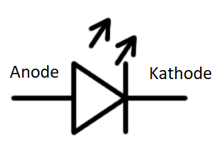
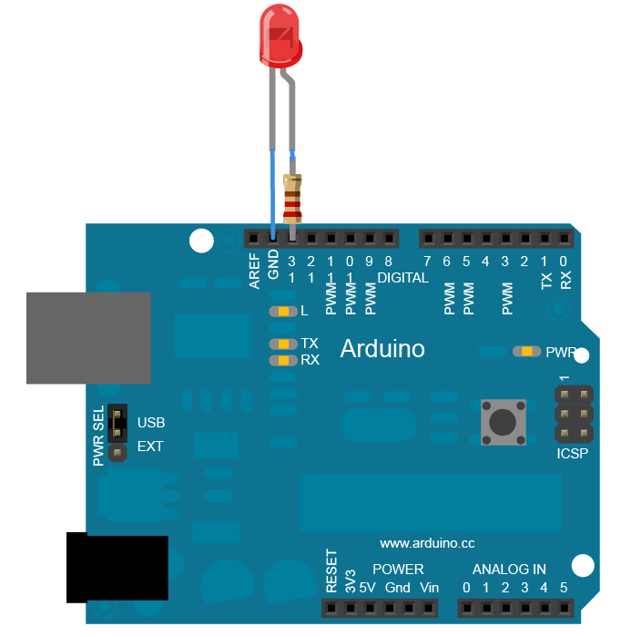

# LED

Een LED of Light Emitting Diode is een actuator. De vereiste stroom is meestal beperkt, waardoor deze rechtstreeks kan aangesloten worden op de arduino.

De LED bevat 2 aansluitpinnen, namelijk de anode en de kathode. De stroom door de led kan enkel van de anode naar de kathode vloeien.



## Aansluiten externe LED

Zowel de arduino uno (pin 13) als de ESP8266 (GPIO14 of D5) bevatten een ingebouwde LED. Het is echter ook mogelijk een externe LED aan te sluiten op alle digitale I/O pinnen.



Voorzie steeds een externe weerstand om de stroom te beperken.

## Voorbeeldprogramma

```cpp
/*
  Blink
  This example code is in the public domain.

  http://www.arduino.cc/en/Tutorial/Blink
*/

// the setup function runs once when you press reset or power the board
void setup() {
  // initialize digital pin LED_BUILTIN as an output.
  pinMode(LED_BUILTIN, OUTPUT);
}

// the loop function runs over and over again forever
void loop() {
  digitalWrite(LED_BUILTIN, HIGH);   // turn the LED on (HIGH is the voltage level)
  delay(1000);                       // wait for a second
  digitalWrite(LED_BUILTIN, LOW);    // turn the LED off by making the voltage LOW
  delay(1000);                       // wait for a second
}
```

Opmerking: de constante LED_BUILTIN is niet bruikbaar op de ESP8266, gebruik hier D5 of pin14.

## Leverancier

LED's zijn o.a. te koop bij opencircuit [opencircuit.nl](https://opencircuit.nl/Product/5mm-Led-rood) 

Weerstanden van 220 ohm zijn o.a. te koop bij opencircuit [opencircuit.nl](https://opencircuit.nl/Product/220%CE%A9-Metaalfilm-weerstand-1-4W-100-stuks) 

## Bron

[arduino.cc](https://www.arduino.cc/en/tutorial/blink) 

