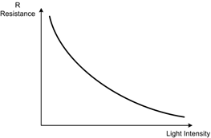
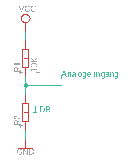
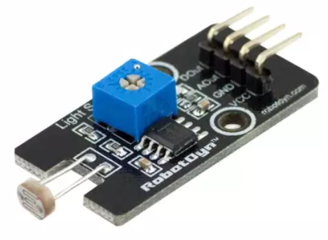

# Lichtsterkte sensor

Met een LDR of licht afhankelijke weerstand is het mogelijk de lichtsterkte te detecteren en deze weer te geven.

Zoals je in onderstaande grafiek kan zien neemt de weerstandswaarde van de LDR af bij een stijging van de lichtsterkte. Het verloop is niet lineair.



# Schema

Met onderstaande schema kan de lichtsterkte als een analoge waarde ingelezen worden.



# Programma

Het programma is volledig hetzelfde voor de arduino UNO en de ESP8266. Het bovenstaande schema kan enkel aangesloten worden op de analoge ingangen.

```cpp
#define LDRPen A0
int readValue;

void setup() {
  // put your setup code here, to run once:
  Serial.begin (9600);
}

void loop() {
  // put your main code here, to run repeatedly:
  readValue = analogReadLDRPen); //analoge spanning omzetten naar een getal en bewaren in de variabele readValue
  Serial.print("Analoge spanning over LDR: ");
  Serial.println(readValue); //Weergave waarde
  delay(1000);
}
```

# Module

Er kan ook gebruikt gemaakt worden van een module. Bij onderstaande model is er zowel een analoge als digitale uitgang. De digitale uitgang kan met een potentiometer ingesteld worden.



Het schema van deze module is te raadplegen op: [Drukknopmodule](https://robotdyn.com/light-sensor-with-analog-digital-outs.html)

De module kan o.a. aangekocht worden op volgende site: [Drukknopmodule](https://opencircuit.nl/Product/Licht-sensor-module-analoge-digitale-output) 
