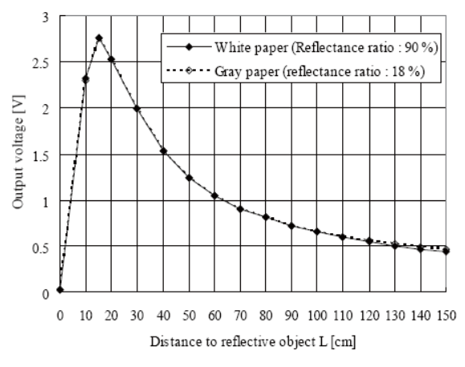
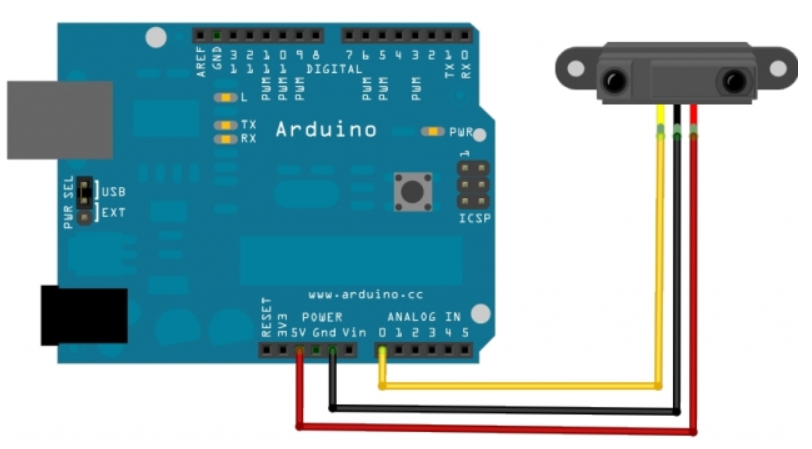

# Optische afstandssensor

Een optische afstandssensor stuurt infrarood licht uit, wat weerkaast wordt wanneer dit op een oppervlak invalt. De sensor zet het ontvangen infrarood licht vervolgens om naar een analoge spanning. Hoe verder de afstand tussen de sensor en het object wat het licht weerkaatst, hoe lager de analoge uitgangsspanning.

Zoals je in onderstaande grafiek kan zien is er geen lineair verloop tussen de afstand en de analoge uitgangsspanning. Eveneens kunnen objecten dicht tegen de sensor niet correct gedetecteerd worden.



## Aansluitschema



De voedingsspanning van de sensor is 5 V, op de ESP8266 is deze eveneens aanwezig. De analoge ingangsspanning wordt nooit boven de 3 V.

## Programma

Het programma is volledig hetzelfde voor de arduino UNO en de ESP8266. Het bovenstaande schema kan enkel aangesloten worden op de analoge ingangen.

```cpp
#define SensorPen A0
int readValue;

void setup() {
  // put your setup code here, to run once:
  Serial.begin (9600);
}

void loop() {
  // put your main code here, to run repeatedly:
  readValue = analogRead(sensorPen); //analoge spanning omzetten naar een getal en bewaren in de variabele readValue
  Serial.print("Analoge spanning is: ");
  Serial.println(readValue); //Weergave waarde
  delay(1000);
}
```
## Opdracht

* Meet de analoge uitgangsspanning bij enkele afstanden en vergelijk deze met de grafiek.

## Bibliotheken

Op het internet zijn bibliotheken te vinden om de afstand relatief correct te meten. Deze zijn meestel enkel geschikt voor de arduino UNO.
Een voorbeeld hiervan is te  vinden op [Makersguides.com ](https://www.makerguides.com/sharp-gp2y0a21yk0f-ir-distance-sensor-arduino-tutorial/)

De module kan o.a. aangekocht worden op volgende site: [site leverancier opencircuit](https://opencircuit.nl/Product/Sharp-GP2Y0A02YK0F-Analoge-Afstands-Sensor-20) 

