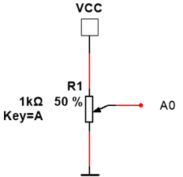

# Potentiometer

Met een potentiometer is het mogelijk een analoge ingangsspanning tussen 0 V en de voedingsspanning te genereren.

## Schema



## Opdrachten

* Bereken de spanning tussen de loper van de potentiometer en de massa wanneer de voedingsspanning 5 V is en de loper op 100 % staat, op 50 % staat en op 0 % staat.
* Bouw de schakeling op een breadboard en meet de spanning tussen de massa en de loper op verschillende standen. Vergelijk deze waardes met de berekende waardes.

## Arduino UNO

De analoge ingangen A0 tot en met A5 zijn geschikt om de loper van de potentiometer aan te sluiten.


## Programma Arduino UNO

```cpp
#define potPen A0
int readValue;

void setup() {
  // put your setup code here, to run once:
  Serial.begin (9600);
}

void loop() {
  // put your main code here, to run repeatedly:
  readValue = analogRead(potPen); //analoge spanning omzetten naar een getal en bewaren in de variabele readValue
  Serial.print("Analoge waarde: ");
  Serial.println(readValue); //Weergave waarde
  delay(1000);
}
```

## ESP8266

Enkel de analoge ingang A0 is geschikt om de loper van de potentimeter aan te sluiten.

## Programma ESP8266

```cpp
#define potPen A0
int readValue;

void setup() {
  // put your setup code here, to run once:
  Serial.begin (9600);
}

void loop() {
  // put your main code here, to run repeatedly:
  readValue = analogRead(potPen); //analoge spanning omzetten naar een getal en bewaren in de variabele readValue
  Serial.print("Analoge waarde: ");
  Serial.println(readValue); //Weergave waarde
  delay(1000);
}
```