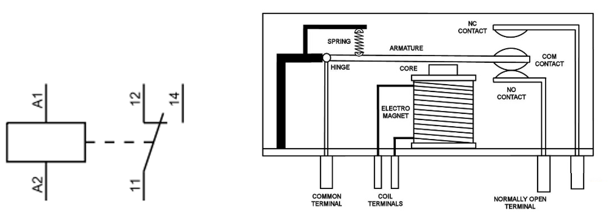
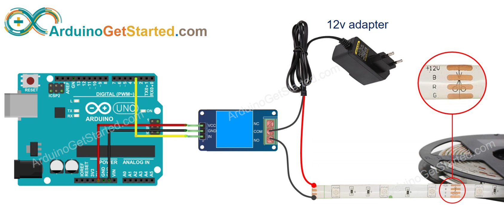

# Relais

Verbruikers die een hogere spanning vereisen of een grotere stroom vragen kunnen gebruik maken van een relais. Enkele mogelijke verbruikers zijn motoren, lampen, ... Een relais kan zowel gelijk- als wisselspanning schakelen.

Wanneer een beperkte stroom door de spoel van het relais vloeit, kan het contact van toestand veranderen. (Van 11-12 naar 11-14) Door de contacten van het relais kan een grotere stroom vloeien.



## Schema

In onderstaande schema wordt een ledstrip in- en uitgeschakeld via een relais.



## Voorbeeldprogramma

```cpp
/*
 * Created by ArduinoGetStarted.com
 *
 * This example code is in the public domain
 *
 * Tutorial page: https://arduinogetstarted.com/tutorials/arduino-relay
 */

// constants won't change
const int RELAY_PIN = 3;  // the Arduino pin, which connects to the IN pin of relay

// the setup function runs once when you press reset or power the board
void setup() {
  // initialize digital pin 9 as an output.
  pinMode(RELAY_PIN, OUTPUT);
}

// the loop function runs over and over again forever
void loop() {
  digitalWrite(RELAY_PIN, HIGH);
  delay(500);
  digitalWrite(RELAY_PIN, LOW);
  delay(500);
}
```

## Leverancier

Relais zijn o.a. te koop bij opencircuit [opencircuit.nl](https://opencircuit.nl/Product/Relais-Module-1-relay-5V-hoog-actief) 

## Bron

[Arduino get started](https://arduinogetstarted.com/tutorials/arduino-relay) 


