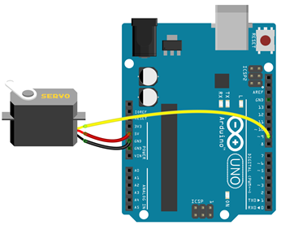

# Servo

## Schema

In onderstaande schema wordt een servo systeem aangesloten.




## Voorbeeldprogramma

```cpp

#include <Servo.h> 
Servo myservo;

void setup() 
{ 
  myservo.attach(9);   //PWM signaal servo op pin 9
  myservo.write(90);  // set servo to mid-point
} 

void loop() {
    myservo.write(0);  // set servo to 0°
    delay(1000);
    myservo.write(90);  // set servo to 90°
    delay(1000);
    myservo.write(180);  // set servo to 180°
    delay(1000);
  } 

```

## Leverancier

Servo's zijn o.a. te koop bij opencircuit [opencircuit.nl](https://opencircuit.be/product/TowerPro-SG90-9G-micro-servo-motor-180) 


